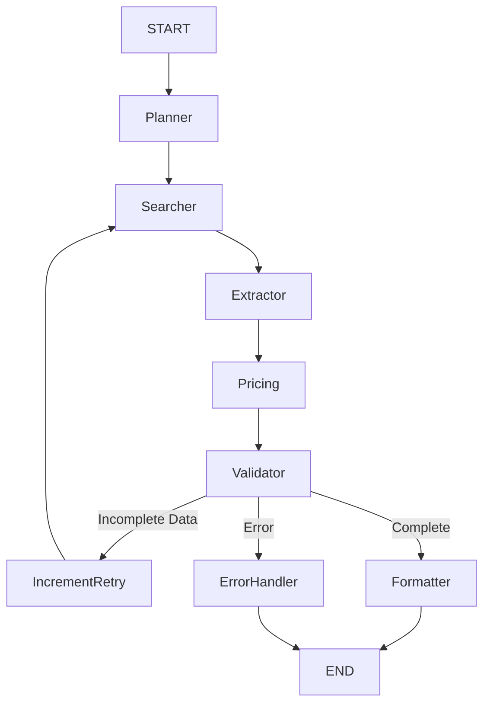

# Hardware Sourcing and Specifications Agent

An autonomous AI agent designed to automate the research of electronic components. The system identifies manufacturer datasheets, extracts technical specifications, performs pricing comparisons across multiple distributors, validates stock availability, and provides a comprehensive structured report. Built using LangGraph, Pydantic, FastAPI, and Streamlit.

---

## Overview

Hardware engineering requires significant manual effort to cross-reference datasheets, compare distributor pricing, and verify stock availability. This agentic system automates this search-and-extraction workflow:

*   **Input**: A component part number or descriptive name (e.g., STM32F103C8T6).
*   **Process**: Autonomous web research, multi-agent data extraction, and real-time distributor database queries.
*   **Output**: A structured technical report including manufacturer specifications, pinout summaries, pricing trends, and stock status.

---

## Core Features

*   **Autonomous Agentic Workflow**: Implemented via LangGraph StateGraph, featuring structured reasoning, conditional transition logic, and automatic retry mechanisms.
*   **Dual-LLM Cross-Validation**: Uses a multi-agent approach (e.g., Gemini 2.0 Flash as primary and Gemini 1.5 Flash as secondary) to verify extracted technical data for high reliability.
*   **Real-time Intelligence**: Integration with Tavily Search API for targeted technical document retrieval and YouTube API for finding relevant hardware tutorials.
*   **Distributor Analysis**: Automated lookup of unit prices, MOQ (Minimum Order Quantity), and stock quantities across major distributors.
*   **Dual Interface Support**:
    *   **Streamlit Dashboard**: A high-performance, interactive UI with real-time agent progress tracking and data visualization.
    *   **FastAPI Backend**: A production-grade REST API with Server-Sent Events (SSE) for streaming agent thought processes.
*   **Data Integrity**: Strict validation using Pydantic v2 models at every interface boundary.

---

## System Architecture

The agent utilizes a custom LangGraph StateGraph (explicit state management) rather than a generic ReAct pattern to ensure deterministic control over the research phases.



### Component Nodes

| Node | Responsibility | Integrated Tools |
| :--- | :--- | :--- |
| **Planner** | Analyzes the initial query and formulates a search strategy. | LLM Reasoning |
| **Searcher** | Executes targeted web searches for datasheets, specs, and tutorials. | Tavily Search, YouTube |
| **Extractor** | Parses raw search results into structured specifications. | Dual-LLM Validation |
| **Pricing** | Retrieves unit pricing and availability data. | Distributor Inventory DB |
| **Validator** | Assesses stock availability and data consistency. | Aggregation Logic |
| **Formatter** | Compiles the final validated report into JSON/UI formats. | Pydantic Serialization |

---

## Getting Started

### 1. Installation

```bash
# Clone the repository
git clone https://github.com/Sujith0513/Hardware_component_search_engine.git
cd Hardware_component_search_engine

# Initialize virtual environment
python -m venv venv
source venv/bin/activate  # On Windows: venv\Scripts\activate

# Install requirements
pip install -r requirements.txt
```

### 2. Configuration

Create a `.env` file in the root directory based on `.env.example`:

```env
TAVILY_API_KEY=your_tavily_key
GOOGLE_API_KEY=your_gemini_key
```

### 3. Execution Modes

#### CLI Interface
Run a direct research query from the terminal:
```bash
python -m src.main "ESP32-WROOM-32"
```

#### Streamlit Dashboard
Launch the interactive web interface:
```bash
streamlit run app.py
```

#### FastAPI Backend
Start the REST API server:
```bash
python api.py
```

---

## API Reference

The system provides a FastAPI backend (running on port 8000 by default) for integration with other services.

*   **GET `/`**: Serves the static web interface.
*   **POST `/api/start_research`**: Initializes a research job.
*   **GET `/api/stream?q={query}`**: Server-Sent Events (SSE) endpoint that streams the agent's real-time reasoning trace.
*   **GET `/api/report?q={query}`**: Retrieves the final structured JSON report for a completed search.

---

## Project Structure

```text
├── api.py                    # FastAPI server and SSE logic
├── app.py                    # Streamlit interactive dashboard
├── requirements.txt          # Project dependencies
├── .env.example              # Environment variable template
├── src/
│   ├── main.py               # CLI entry point
│   ├── agent.py              # LangGraph orchestration logic
│   ├── state.py              # Pydantic schema and state definitions
│   ├── tools/
│   │   ├── tavily_search.py  # Web research integration
│   │   ├── datasheet_extractor.py # LLM extraction and validation
│   │   ├── pricing_lookup.py # Inventory and pricing lookup
│   │   └── stock_validator.py # Stock availability analysis
│   ├── utils/
│   │   ├── logger.py         # Loguru configuration
│   │   └── cache.py          # TTL-based data caching
│   └── data/
│       └── mock_pricing.json # Component database for demonstration
├── static/                   # Frontend assets for the FastAPI interface
└── tests/                    # Unit and integration test suites
```

---

## Technology Stack

| Layer | Technology |
| :--- | :--- |
| **Orchestration** | LangGraph StateGraph |
| **LLMs** | Google Gemini 2.0 Flash & Gemini 1.5 Flash |
| **API Framework** | FastAPI |
| **UI Framework** | Streamlit |
| **Search Engine** | Tavily Search API |
| **Data Validation** | Pydantic v2 |
| **Logging** | Loguru |

---

## Development and Testing

The project utilizes `pytest` for quality assurance.

```bash
# Run the complete test suite
pytest tests/

# Run specific integration tests
pytest tests/test_agent.py
```

---

## Future Roadmap

1.  **Direct Distributor API Integration**: Transition from demonstration data to live Mouser/DigiKey API integrations.
2.  **Comparative Analysis**: Enable side-by-side technical comparison of multiple part numbers.
3.  **Advanced PDF Parsing**: Direct extraction of pinout diagrams and graphs from binary PDF files.
4.  **Persistent Storage**: Integration of Vector Databases for long-term component specification storage.

---

## License

This project is submitted as a technical assessment for the Lumiq.ai internship.

---

*Built using LangGraph, Pydantic, and Streamlit*